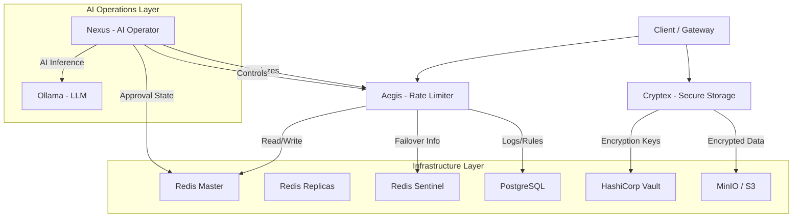

# Titan Grid - System Design & Architecture Overview

## 1. High-Level Architecture

Titan Grid is a distributed, high-security microservices ecosystem designed for resilience, observability, and AI-driven operations. It follows a **Service-Oriented Architecture (SOA)** with distinct responsibilities for rate limiting, secure storage, and AI orchestration.

### System Diagrams

### Core Services

1.  **Aegis (Java / Spring Boot)**:
    *   **Role**: Distributed Rate Limiting Service.
    *   **Responsibility**: Protects APIs from abuse using advanced algorithms and dynamic rules.
    *   **Capabilities**: High-throughput processing, circuit breaking, fail-open/close strategies, and runtime rule configuration.

2.  **Cryptex (Java / Spring Boot)**:
    *   **Role**: Zero-Trust Secure Storage Service.
    *   **Responsibility**: Encrypts and stores files.
    *   **Capabilities**: Streaming envelope encryption, Vault integration for key management, S3/MinIO compatible.

3.  **Nexus (Python / FastAPI)**:
    *   **Role**: AI Operator & Supervisor.
    *   **Responsibility**: Monitors system health, analyzes security events, and executes administrative actions.
    *   **Capabilities**: Uses LLMs (via Ollama) to analyze attack patterns and implements "Human-in-the-loop" (HITL) protocols for dangerous actions.

---

## 2. Low-Level Design & Implementation Details

### A. Aegis - Distributed Rate Limiter
*   **Algorithm**: **Sliding Window Counter**. Uses Redis Sorted Sets (ZSET) to track requests with microsecond precision, avoiding "boundary burst" issues of fixed windows.
*   **Rule Engine (Priority System)**:
    Aegis resolves rate limits dynamically using a 3-tier strategy (`RateLimitRuleResolver.java`):
    1.  **@RateLimit Annotation**: Highest priority. Defined in code for specific critical endpoints.
    2.  **Database Rules**: Runtime configurable via `rate_limit_rules` table (PostgreSQL). allowing Admin/AI to change limits without restarts.
    3.  **YAML Config**: Default global fallback.
*   **Implementation**:
    *   **Key Format**: `rate_limit:{clientId}:{endpoint}`.
    *   **Atomic Operations**: Uses **Lua Scripts** to check usage and update counters in a single atomic step.
*   **Resilience**:
    *   **Circuit Breaker (Resilience4j)**: Fails open (allows traffic) if Redis becomes unreachable.
    *   **Redis Sentinel**: Handles automatic master-slave failover.

### B. Cryptex - Zero-Trust Storage
*   **Pattern**: **Envelope Encryption**.
*   **Process**:
    1.  **DEK Generation**: For every file upload, a unique random **Data Encryption Key (DEK)** (AES-256) is generated.
    2.  **Key Encryption**: The DEK itself is encrypted using a master key stored in **HashiCorp Vault** (Transit Engine).
    3.  **Streaming Encryption**: The file content is encrypted on-the-fly using **AES-GCM** (Galois/Counter Mode) with the plaintext DEK.
    4.  **Storage**: The file is stored in MinIO as: `[Header: IV + Encrypted DEK] + [Ciphertext Body]`.
*   **Why implementation is standard**:
    *   **Memory Efficiency**: Uses `CipherInputStream` to encrypt GB-sized files with constant RAM usage.
    *   **Zero Trust**: The storage backend (MinIO/AWS) *never* sees the plaintext data or the encryption keys.

### C. Nexus - AI Operator (MCP Server)
*   **Protocol**: **Model Context Protocol (MCP)**.
*   **Safety Interlock**:
    *   **Problem**: AI agents can hallucinate or make mistakes (e.g., banning a valid IP).
    *   **Solution**: **Two-Phase Commit** for dangerous actions.
    *   **Mechanism**:
        1.  Tool `ban_suspicious_ip` generates a secure **Token** and caches the intent in Redis.
        2.  Returns "Requires Approval" message + Token.
        3.  Human must invoke `approve_action(token)` to execute the actual logic.

---

## 3. Communication Flows

### Flow 1: API Request Rate Check
1.  **Service/Gateway** calls `Aegis.isAllowed(clientId, path)`.
2.  **Aegis Rule Resolver** determines limits:
    *   Checks for `@RateLimit` on method.
    *   If none, queries **PostgreSQL** (cached) for dynamic rules matching the path.
    *   If none, uses default config.
3.  **Aegis** executes **Lua Script** on **Redis Master**.
4.  **Redis** returns `{allowed: true, remaining: 99}`.
5.  **Aegis** returns decision to caller.

### Flow 2: Secure File Upload
1.  **Client** POSTs file stream to **Cryptex**.
2.  **Cryptex** authenticates with **Vault** to encrypt a new DEK.
3.  **Cryptex** opens stream to **MinIO**.
4.  **Cryptex** pipelines the streams: `Client -> AES Cipher -> MinIO`.
5.  **MinIO** confirms write.
6.  **Cryptex** returns success to Client.

### Flow 3: AI Security Response (Human-in-the-Loop)
1.  **User** asks Nexus: "Analyze recent attacks".
2.  **Nexus** calls `get_security_events` (fetches from Aegis/Logs).
3.  **LLM** analyzes logs and suggests: "IP 1.2.3.4 is attacking. Ban it."
4.  **Nexus** calls `ban_suspicious_ip(ip="1.2.3.4")`.
5.  **Nexus Code** detects `DANGEROUS_TOOL` flag.
6.  **Nexus** generates token `ABCD`, stores action in Redis, returns: "I need approval. Token: ABCD".
7.  **User** reviews and says: "Approve ABCD".
8.  **Nexus** calls `approve_action(token="ABCD")`.
9.  **Nexus** retrieves action from Redis and executes the ban in **Aegis**.

---

## 4. Industry Standards Alignment

| Feature | Standard | Titan Grid Implementation |
| :--- | :--- | :--- |
| **Availability** | **High Availability (HA)** | Redis Sentinel for auto-failover; Circuit Breakers for fault tolerance. |
| **Security** | **Zero Trust** | Data is encrypted *before* leaving the service; Keys managed via Vault. |
| **Configuration** | **Dynamic Configuration** | Database-backed rule engine allows changing rate limits without redeployment. |
| **Concurrency** | **Atomic Execution** | Lua scripts ensure data integrity under high load. |
| **AI Safety** | **Human-in-the-Loop** | Critical actions require explicit human confirmation via 2-step token process. |
| **Observability** | **Metrics & Logging** | Prometheus/Grafana integration for real-time monitoring. |

---

## 5. Observability & Developer Tooling

Titan Grid provides a comprehensive suite of tools for debugging and monitoring the system state in real-time.

### Graphical User Interfaces (GUI)
As detailed in `docs/day_wise/GUI_SETUP.md`, the system is designed to be inspected using standard industry tools:
*   **RedisInsight**: Connects to `titan-redis-master` to visualize rate limit keys (`rate_limit:*`), inspect TTLs, and monitor real-time command streams.
*   **DBeaver / pgAdmin**: Connects to `titan-postgres` to view the `aegis` schema, including active `rate_limit_rules` and historical `rate_limit_events`.

### API Exploration & Testing
*   **Swagger UI**: Aegis exposes a visual API documentation at `http://localhost:8080/swagger-ui.html`, allowing developers to test endpoints (`/allowed`, `/strict`) directly from the browser.
*   **Prometheus Metrics**: Exposed at `/actuator/prometheus`, providing low-level insight into JVM memory, GC pauses, and custom Aegis metrics (e.g., `aegis_blocked_total`).
